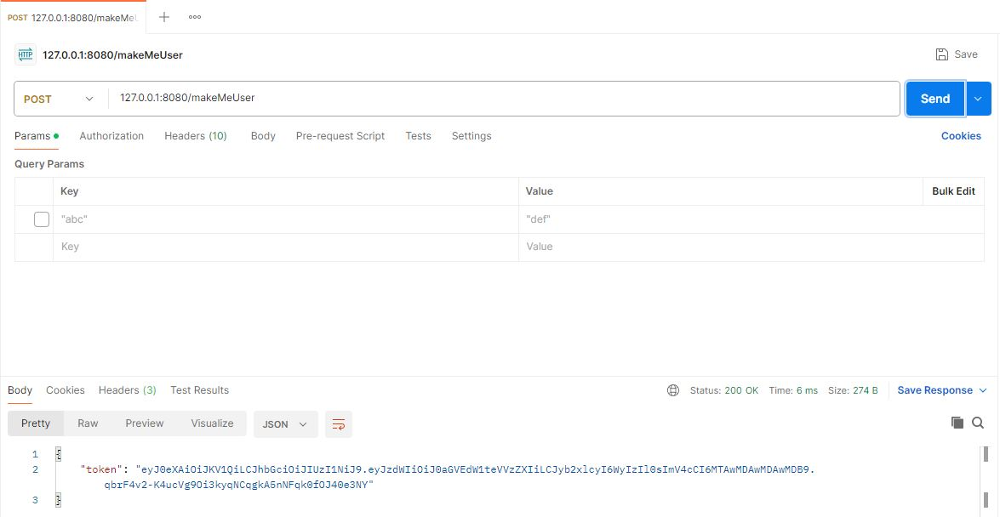
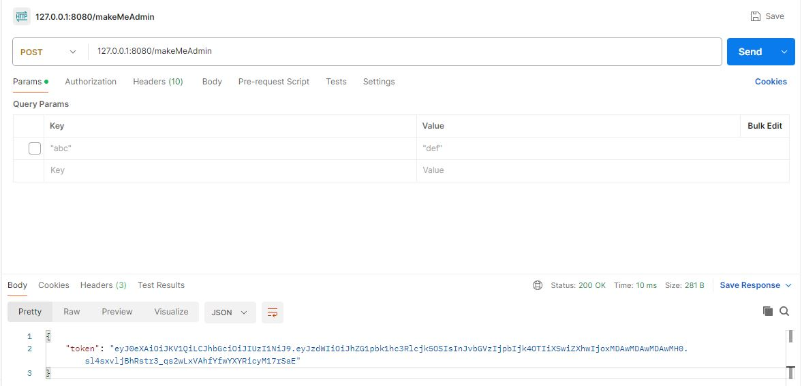
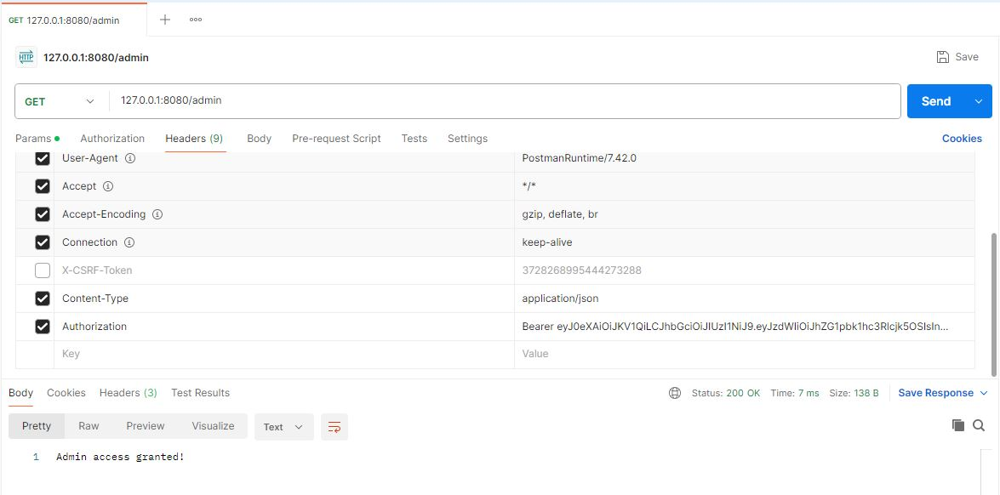
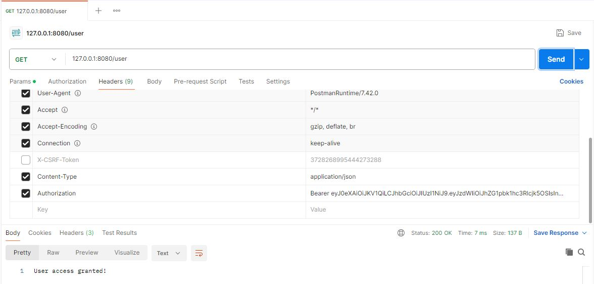
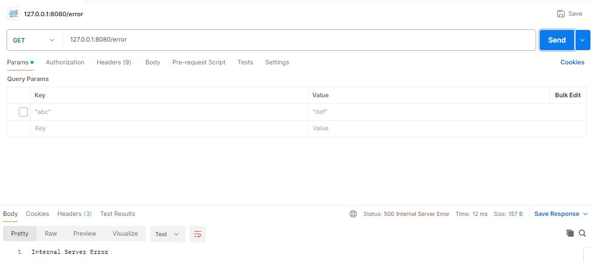
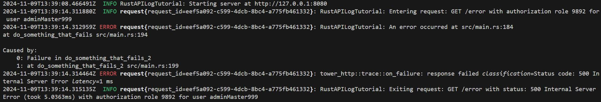
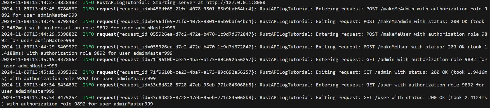

# RustAPILogTutorial
Rust tutorial that goes over setting logs with an API

## Documentation
The most important method of this tutorial is the log_middleware method. This is the core of this tutorial.

To use this API, you can start by using the /makeMeAdmin or /makeMeUser URLs to get your tokens.

Here are some examples to query those URLs with Postman (assuming you started the application with 'cargo run' before)

Depending on which one you called, you will have a token that determines whether you have the authorization to view the /admin and /user URLs. You will notice that those endpoints will retun you with a token answer. Take that token, and go to your Headers in Postman. Set a new header named 'Authorization' with value 'Bearer \YOUR_TOKEN\', where \YOUR_TOKEN\ represents the value received from the JSON response of your previously called endpoint (either /makeMeUser or /makeMeAdmin)

Once this is done, you can go to the /admin and/or /user endpoints, and see if you have authorization. 

If you took the token from /makeMeAdmin, you can access both endpoints.

If you took the token from /makeMeUser, you can only access the endpoint /user. The /admin one will return you a response of 'Forbidden'.

If you have not taken the token to your headers, both endpoints will return 'Forbidden'!

### Errors
To test the logs for errors, I created an /error endpoint. You can call it without a token and it will result in 'Internal Server Error'. However, the logs will include your Authorization if you do have a token in your headers.

### Logs Results
If we look at the logs following the /error endpoint call, we have a wonderful example of what the logs show us.

To have these logs, we had to do many things:
1. Create a middleware in axum that intercepts all requests to give context on the request. This means:
    1. The method used to call the endpoint (GET, POST, etc.)
    2. The endpoint URL (/makeMeUser, /makeMeAdmin, etc.)
    3. The user's authorization (9892 for admin, 3 for user)
    4. The user's username
    5. The time elapsed for the request (only on exit request) to see if any request took a lot of time
    6. The status return for the request (only on exit request) like 200 OK, 500 Internal Server Error, etc.
    7. The request UUID (very important when using concurrency, to track a user's calls to endpoints)
2. Create a span using tracing to prefix the requests with a request UUID to follow them easily
3. Use of the 'anyhow' crate to give some context and trace for the errors that are generated by the code
    1. A context function is called at every step of the way to give information as to where the request came from
    2. Created a utility function to provide us with the file and line that crashed and put that into the context

Here is a second example of some logs output:

